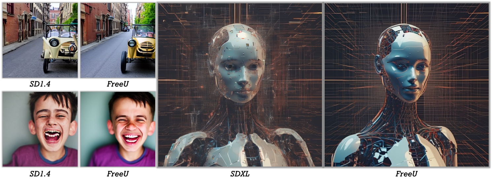

<div align="center">

<h1>FreeU: Free Lunch in Diffusion U-Net</h1>

<div>
    <a href="https://chenyangsi.github.io/" target="_blank">Chenyang Si</a><sup></sup>,
    <a href="https://ziqihuangg.github.io/" target="_blank">Ziqi Huang</a><sup></sup>,
    <a href="https://yumingj.github.io/" target="_blank">Yuming Jiang</a><sup></sup>,
    <a href="https://liuziwei7.github.io/" target="_blank">Ziwei Liu</a><sup></sup>
</div>
<div>
    <sup></sup>S-Lab, Nanyang Technological University
</div>

[Paper](https://arxiv.org/pdf/2309.11497.pdf) | [Project Page](https://chenyangsi.top/FreeU/) | [Video](https://www.youtube.com/watch?v=-CZ5uWxvX30&t=2s)
</br>

<strong>We propose FreeU, a method that substantially improves diffusion model sample quality at no costs: no training, no additional parameter introduced, and no increase in memory or sampling time.</strong>

<div style="width: 100%; text-align: center; margin:auto;">
    
</div>

:open_book: For more visual results, go checkout our <a href="https://chenyangsi.top/FreeU/" target="_blank">project page</a>
</div>


If you find FreeU useful for your work please cite:
```
@article{Si2023FreeU,
  author    = {Chenyang Si, Ziqi Huang, Yuming Jiang, Ziwei Liu},
  title     = {FreeU: Free Lunch in Diffusion U-Net},
  journal   = {arXiv},
  year      = {2023},
}
```
## :newspaper_roll: License

Distributed under the S-Lab License. See `LICENSE` for more information.

